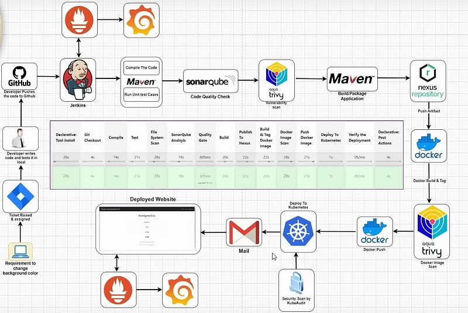

# Streamlining Development: The Ultimate CI/CD Pipeline

## Overview

Our CI/CD pipeline leverages a suite of powerful tools to automate the entire development lifecycle, from code changes to deployment. Here's a high-level overview of the tools and technologies involved:
- **Version Control**: GitHub
- **Build Automation**: Jenkins
- **Dependency Management and Build**: Maven
- **Code Quality**: SonarQube
- **Vulnerability Scanning**: Aqua Trivy
- **Artifact Management**: Nexus Repository
- **Containerization**: Docker
- **Orchestration**: Kubernetes
- **Monitoring**: Prometheus and Grafana



## Phases

### Phase 1: Setup the Environment on AWS EC2 Instances

1. **Launch EC2 Instances**:
   - Launch multiple EC2 instances for Jenkins, SonarQube, Nexus Repository, and Kubernetes cluster (master and worker nodes).

2. **Install Docker**:
   - Install Docker on each EC2 instance.

   ```sh
   sudo apt-get update
   sudo apt-get install -y docker.io
   sudo systemctl start docker
   sudo systemctl enable docker
   ```

3. **Setup Kubernetes Cluster**:
   - Initialize Kubernetes on the master node and join worker nodes.

   ```sh
   # On Master Node
   kubeadm init --pod-network-cidr=10.244.0.0/16

   # On Worker Nodes
   kubeadm join <master-node-ip>:<master-node-port> --token <token> --discovery-token-ca-cert-hash sha256:<hash>
   ```

4. **Install Prometheus and Grafana**:
   - Deploy Prometheus and Grafana on the Kubernetes cluster.

   ```sh
   kubectl apply -f prometheus-deployment.yaml
   kubectl apply -f grafana-deployment.yaml
   ```

5. **Install Jenkins**:
   - Install Jenkins on your dedicated EC2 instance.

   ```sh
   sudo apt-get update
   sudo apt-get install -y openjdk-11-jdk
   wget -q -O - https://pkg.jenkins.io/debian/jenkins.io.key | sudo apt-key add -
   sudo sh -c 'echo deb http://pkg.jenkins.io/debian-stable binary/ > /etc/apt/sources.list.d/jenkins.list'
   sudo apt-get update
   sudo apt-get install -y jenkins
   sudo systemctl start jenkins
   sudo systemctl enable jenkins
   ```
6. **Configure SonarQube**:
   - Setup SonarQube on its dedicated EC2 instance and configure it to work with Jenkins.

7. **Setup Nexus Repository**:
   - Install and configure Nexus Repository on its dedicated EC2 instance for artifact management.


### Phase 2: Setup the Git Repository

1. **Create GitHub Repository**:
   - Create a new repository on GitHub for your project.

2. **Clone the Repository**:
   - Clone the repository to your local machine.

   ```sh
   git clone https://github.com/your-username/your-repo.git
   cd your-repo
   ```

3. **Add Source Code**:
   - Add your source code to the repository and commit the changes.

   ```sh
   git add .
   git commit -m "Initial commit"
   git push origin main
   ```

### Phase 3: CI/CD Configuration with Jenkins and Other Tools

1. **Setup Jenkins Pipeline**:
   - Create a Jenkins pipeline to automate the build, test, and deployment process.

2. **Install and Configure Jenkins Plugins**:
   - Install necessary Jenkins plugins (Docker, Maven, SonarQube, Kubernetes, Trivy).

3. **Setup Jenkins Jobs**:
   - Create Jenkins jobs for each phase of the pipeline (build, test, scan, deploy).

4. **Deploy Application with Kubernetes**:
   - Use Kubernetes to deploy your Dockerized application.

   ```sh
   kubectl apply -f deployment.yaml
   ```


### Phase 4: Installation and Setup of Jenkins and the Deployed Website with Grafana and Prometheus

1. **Setup Prometheus and Grafana Dashboards**:
   - Configure Prometheus to scrape metrics from Jenkins and Kubernetes.
   - Create Grafana dashboards to visualize the metrics collected by Prometheus.

## Conclusion

By following these phases, you will have a robust CI/CD pipeline that automates the entire development lifecycle, ensures code quality and security, and provides continuous monitoring of your applications. 